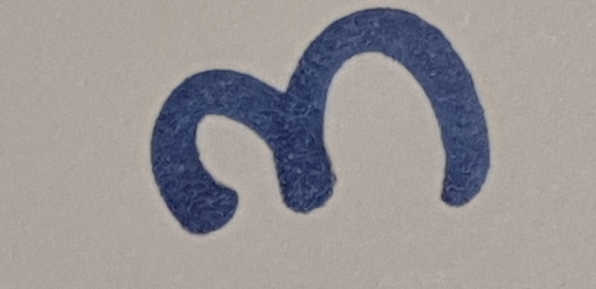

## Tutorial 1 : MNIST

*You need to set directories on ```{your_directory}/AI_begiiner_course/DL_course/Image_Classification```*

Don't forget below line :
```shell
cd AI_beginner_course/DL_course/Image_Classification/
```

1. Training Phase : See this [link(colab)](https://colab.research.google.com/drive/1cDfsA_no_bLmv5S7217nL0UcEd2nZ1Hr?usp=sharing)

	We trained 50,000 numbers of images(Open Dataset, MNIST).

	You may remember the only ```mnist_99acc_model.h5``` file. (You can [Download here](https://docs.google.com/uc?export=download&id=1tTfB7C4Imavg_ppIwXk0DG-cRkA5P_mt))

	It helps to load model paramters easily. 

	In this course, you can train in colab with GPU for free. It is too hard to train mnist datasets with Jetson Nano toolkits, because of low memories. **I strongly recommend to train with devices having GPUs.**

2. Data Preparation : See this [link(colab)](https://colab.research.google.com/drive/18eUHkOg5jy2YgugphupEjhuAMmem56uD?usp=sharing)
	
	This helps your handmade datasets to become suitable inputs of this model.

	I wrote this codes about Data Preprocessing.

	- How to run? (Your directories must be on ```Image_Classification/```)

		1. Prepare only a written number (0 ~ 9)	

		There are some rules. Keep in mind!

		```
		1. The written number should be enough large (Recommend to take over the 60% area)
		2. The written number should be the only one number
		  (e.g. never recognize 32, 64, 58... Only allow "0", "3". etc.)
		3. The more Pen thickness, the better.
		4. The background (paper) should be white. Don't shade the light by cameras.
		```

		For example,
		
		
		
		Then, these result will be

		

		2. Let's Run "Data_Preparation.py"
	
		Note that we don't care what the file names are. You only need any ".jpg" files
		
		At, ```{your_directory}AI_beginner_course/DL_course/Image_Classification}```,
		```shell
		$ tree .
		.
		├── Data_Preparation.py
		├── Test_0.jpg
		├── Test_1.jpg
		├── Test_2.jpg
		└── Test_3.jpg

		0 directories, 5 files
		```
		
		Then ```*.jpg``` files will convert to ```Preprocessed_i.jpg``` files by running this py :
		

		```shell
		python3 Data_Preparation.py
		```

		Results:
		```shell
		$ tree .
		.
		├── Data_Preparation.py
		├── PreProcessed
		│   ├── Preprocessed_0.jpg
		│   ├── Preprocessed_1.jpg
		│   ├── Preprocessed_2.jpg
		│   └── Preprocessed_3.jpg
		├── Test_0.jpg
		├── Test_1.jpg
		├── Test_2.jpg
		└── Test_3.jpg

		1 directory, 9 files
		```


3. Inference : See this [link(colab)](https://colab.research.google.com/drive/18eUHkOg5jy2YgugphupEjhuAMmem56uD?usp=sharing) (Same as 2)

	You can test on your written numbers at ```AI_beginner_course/Image_Classification/Inference.py```.
	Your written and resized ```PreProcessed/Preprocessed_i.jpg``` files will be evaluated from saved ```Image_Classification/mnist_99acc_model.h5``` Anyway, 

	```shell
	$ python3 Inference.py
	
	(omit)

	In PreProcessed folder, there are files :
	 ['PreProcessed/Preprocessed_0.jpg', 'PreProcessed/Preprocessed_1.jpg', 'PreProcessed/Preprocessed_2.jpg', 'PreProcessed/Preprocessed_3.jpg'] 
	
	(omit)
	
	From PreProcessed/Preprocessed_0.jpg, We predicted :  [3] .

	From PreProcessed/Preprocessed_1.jpg, We predicted :  [7] .

	From PreProcessed/Preprocessed_2.jpg, We predicted :  [8] .

	From PreProcessed/Preprocessed_3.jpg, We predicted :  [4] .
	```


From now on, you've checked a simple model training and inference with MNIST!


## Tutorial 2 : Fashion MNIST

We'll introduce Later
