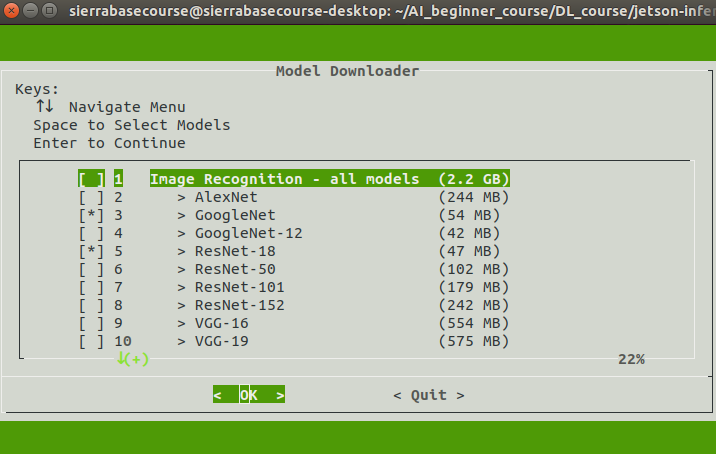
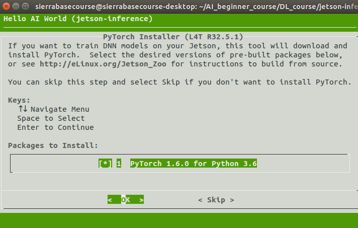
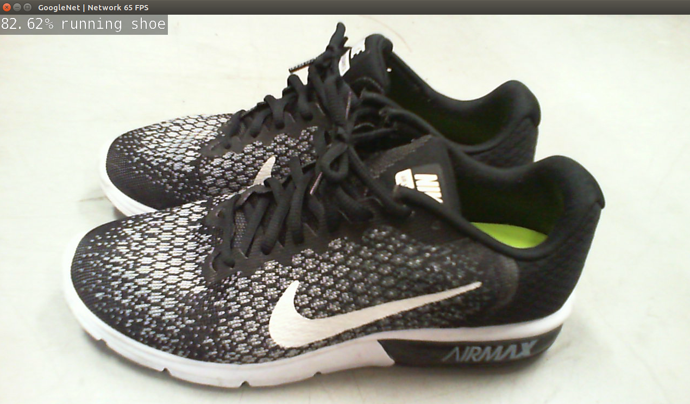
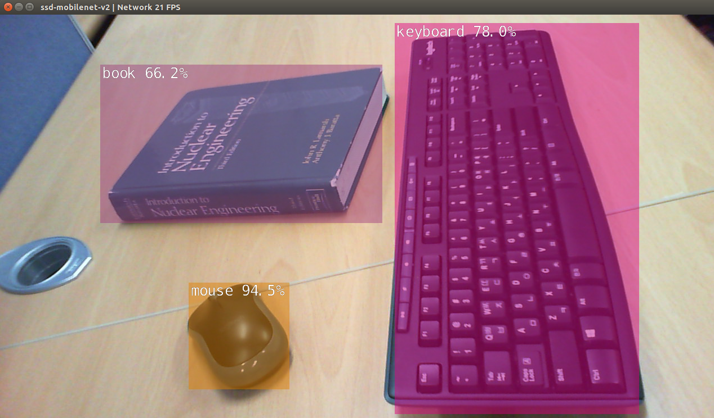

## Introduction : Jetson-Inference

```Jetson Inference``` is an opensource to introduce Deep Neural Network models, which can run in real-time and accurately. Especially, this repository uses NVIDIA TensorRT for efficiently deploying neural networks onto the embedded Jetson platform(e.g. nano, tx2, xaiver ...), improving performance and power efficiency using graph optimizations, kernel fusion, and FP(Float Precision)16/INT8 precision. In more details, refer to [this site(github)](https://github.com/dusty-nv/jetson-inference).

Morerover, it supports to

- training (Transfer Learning / Re-training)
	- Classification
		- Cat/Dog Dataset
		- PlantCLEF Dataset
		- Your Own Image Dataset
	- Object Detection
		- SSD-Mobilenet Network
		- Your Own Detection Dataset
- Inference
	- Classification
		- Imagenet with Image / Video
		- your Own Image
	- Object Detection
		- Face
		- COCO containing dogs, bottles, etc.
	- Semantic Segmentation
		- Cityspcapes Dataset
		- DeepScene Dataset etc.


## 1. Build models

Note that you need to get ready for download opensource.

1. Go into ```AI_beginner_course/DL_course/``` and download opensource.

	```shell
	$ cd ..
	$ git clone https://github.com/dusty-nv/jetson-inference
	$ cd jetson-inference
	$ git submodule update --init
	```

2. Set some settings for build.

	```shell
	$ mkdir build
	$ cd build
	$ cmake ../
	```

	You might be confused because of the options of cmake. Note that the default models is

	- Image Recoginition
		- GoogleNet
		- ResNet-18
	- Object Detection
		- SSD-MobileNet-v2
		- PedNet
		- FaceNet
		- DetectNet-COCO-Dog
	- Semantic Segmentation
		- FCN-ResNet18-Cityspaces-512x256
		- FCN-ResNet18-DeepScene-576x320
		- FCN-ResNet18-MHP-512x320
		- FCN-ResNet18-Pascal-VOC-320x320
		- FCN-ResNet18-SUN-RGBD-512x400

	**Just press ```enter```**(Recommend). If you want to download all, you can select menu, where contains "all models", by pressing ```spacebar```.

	

	Moreover, in this case, I recommend to select to install ```pytorch```

	

	It will take a lot of time( ~ 20 mins).

3. Let's build and compile!

	```shell
	$ make -j$(nproc)
	$ sudo make install
	$ sudo ldconfig
	```

## 2. Let's Run some files

Let's check the results of pretrained models.

* Image Classification - [ImageNet](http://www.image-net.org/)

Here it is a basic step :

```shell
$ cd aarch64/bin/
$ python3 imagenet.py /dev/video0
```

And here is a result,



Note that the default option of ```imagenet.py``` file is ```network=GoogLeNet```
On the other hand, the location ```/dev/video0``` indicates your input sources. That is, you used **USB CAMERA**

You can change other models. Then, let's change the other model, ```ResNet-18```!!

```shell
$ python3 imagenet.py --network=resnet-18 /dev/video0
```

There is a table shows jetson-inference repository supports.

| Network       | CLI argument   | NetworkType enum |
|:-------------:|----------------|------------------|
| AlexNet       | `alexnet`      | `ALEXNET`        |
| GoogleNet     | `googlenet`    | `GOOGLENET`      |
| GoogleNet-12  | `googlenet-12` | `GOOGLENET_12`   |
| ResNet-18     | `resnet-18`    | `RESNET_18`      |
| ResNet-50     | `resnet-50`    | `RESNET_50`      |
| ResNet-101    | `resnet-101`   | `RESNET_101`     |
| ResNet-152    | `resnet-152`   | `RESNET_152`     |
| VGG-16        | `vgg-16`       | `VGG-16`         |
| VGG-19        | `vgg-19`       | `VGG-19`         |
| Inception-v4  | `inception-v4` | `INCEPTION_V4`   |

You could see the various models before build makes. In details, please visit [this github site](https://github.com/dusty-nv/jetson-inference).

* Object Detection 
	
Object Detection models show the bounded boxes we trained. 

```shell
$ python3 detectnet.py /dev/video0
```

Then, the result will be,



In this case, we can check the default network is SSD-MobileNet-V2. and the below table is network model list. and [COCO](https://cocodataset.org/#home) is the most used Image Datasets. There are many labelings (Person, chair, animals, ... and so on) in COCO Datasets. For training them, we need much times and expensive devices. So we simply introduce object detection's inference.

| Network                 | CLI argument       | NetworkType enum   | Object classes       |
| ------------------------|--------------------|--------------------|----------------------|
| SSD-Mobilenet-v1        | `ssd-mobilenet-v1` | `SSD_MOBILENET_V1` | 91 (COCO classes)	   |
| SSD-Mobilenet-v2        | `ssd-mobilenet-v2` | `SSD_MOBILENET_V2` | 91 (COCO classes)    |
| SSD-Inception-v2        | `ssd-inception-v2` | `SSD_INCEPTION_V2` | 91 (COCO classes)    |
| DetectNet-COCO-Dog      | `coco-dog`         | `COCO_DOG`         | dogs                 |
| DetectNet-COCO-Bottle   | `coco-bottle`      | `COCO_BOTTLE`      | bottles              |
| DetectNet-COCO-Chair    | `coco-chair`       | `COCO_CHAIR`       | chairs               |
| DetectNet-COCO-Airplane | `coco-airplane`    | `COCO_AIRPLANE`    | airplanes            |
| ped-100                 | `pednet`           | `PEDNET`           | pedestrians          |
| multiped-500            | `multiped`         | `PEDNET_MULTI`     | pedestrians, luggage |
| facenet-120             | `facenet`          | `FACENET`          | faces                |

You may choose other networks. Copy from the CLI argument of the table. This is an example to detect our face.

```shell
$ python3 detectnet.py --network=facenet /dev/video0
```

* Semantic Segmentation.

Semantic Segmentation models can show the more accurate area to express objects. 

The default model is ```FCN-ResNet18-Pascal-VOC-320x320```

```shell
$ python3 segnet.py /dev/video0
```

| Dataset      | Resolution | CLI Argument |
|:------------:|:----------:|--------------|
| [Cityscapes](https://www.cityscapes-dataset.com/) | 512x256 | `fcn-resnet18-cityscapes-512x256` | 
| [Cityscapes](https://www.cityscapes-dataset.com/) | 1024x512 | `fcn-resnet18-cityscapes-1024x512` |
| [Cityscapes](https://www.cityscapes-dataset.com/) | 2048x1024 | `fcn-resnet18-cityscapes-2048x1024` |
| [DeepScene](http://deepscene.cs.uni-freiburg.de/) | 576x320 | `fcn-resnet18-deepscene-576x320` |
| [DeepScene](http://deepscene.cs.uni-freiburg.de/) | 864x480 | `fcn-resnet18-deepscene-864x480` |
| [Multi-Human](https://lv-mhp.github.io/) | 512x320 | `fcn-resnet18-mhp-512x320` |
| [Multi-Human](https://lv-mhp.github.io/) | 640x360 | `fcn-resnet18-mhp-512x320` |
| [Pascal VOC](http://host.robots.ox.ac.uk/pascal/VOC/) | 320x320 | `fcn-resnet18-voc-320x320` |
| [Pascal VOC](http://host.robots.ox.ac.uk/pascal/VOC/) | 512x320 | `fcn-resnet18-voc-512x320` |
| [SUN RGB-D](http://rgbd.cs.princeton.edu/) | 512x400 | `fcn-resnet18-sun-512x400` |
| [SUN RGB-D](http://rgbd.cs.princeton.edu/) | 640x512 | `fcn-resnet18-sun-640x512` |

the another installed network is ```FCN-ResNet18-DeepScene-576x320``` Let's try this.

```shell
$ python3 segnet.py --network=fcn-resnet18-deepscene-576x320 /dev/video0
```


## Introduction : NVIDIA DeepStream

WE CHECK IT LATER! (BECAUSE WE HAVE TO CHECK LICENSE...)
